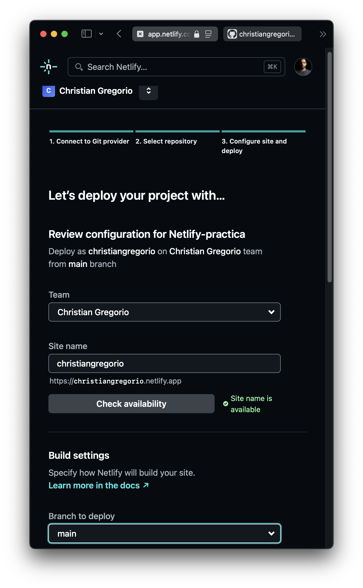

# Netlify-práctica

## Objetivo
El objetivo de este tutorial es implementar un despliegue continuo de una web que muestre nuestro currículum utilizando Netlify y GitHub. Esto permitirá que cualquier cambio futuro que hagamos en el repositorio se actualice automáticamente en la web desplegada. Para este proyecto, utilizaremos HTML y Bootstrap.

## Proceso y capturas
Crearemos un repositorio en GitHub que importaremos en Netlify. Desde allí, configuraremos el despliegue automático para que, cada vez que se realice un commit en la rama main, Netlify detecte y publique los cambios automáticamente en el sitio.

### 1. Creación del repositorio GitHub
1. Creamos un nuevo repositorio vacío en GitHub, que será la base del proyecto donde subiremos nuestro currículum.
  
   

### 2. Importación del repositorio en Netlify
1. Iniciamos sesión en Netlify con nuestra cuenta de GitHub y otorgamos permisos para acceder a nuestro repositorio.
2. Seleccionamos el origen de importación como **GitHub**.

   
   
3. Autorizamos a Netlify para acceder a nuestro repositorio verificando nuestra identidad de GitHub.

   

4. Seleccionamos el repositorio que hemos creado previamente y modificamos los permisos para aplicar el despliegue solo a este repositorio.

   

5. Una vez que Netlify recibe el permiso, procedemos con la configuración del despliegue.

### 3. Configuración del despliegue
1. En la configuración, establecemos el nombre de la web y la rama de GitHub desde la cual se realizará el despliegue automático. En este caso, usamos la URL `https://christiangregorio.netlify.app` y la rama `main`.

   

2. Hacemos clic en **Deploy** para iniciar el primer despliegue.

   

3. Verificamos el estado del despliegue inicial. En este punto, el sitio puede mostrar solo el archivo README.md, ya que aún no hemos añadido contenido de nuestro currículum.

   

### 4. Subida inicial de archivos al repositorio
1. Hacemos un commit en la rama main del repositorio de GitHub con los archivos de nuestra web (HTML y Bootstrap para el currículum).
2. Al realizar este commit, Netlify detectará los cambios y lanzará automáticamente el despliegue en el sitio.

   
   
3. En el panel de Netlify, podemos ver el log del despliegue y confirmar que se han añadido los archivos.

   

### 5. Actualización y despliegue automático
1. Realizamos cambios en el repositorio (por ejemplo, modificamos el contenido del currículum o añadimos nuevas secciones).
2. Cada vez que se sube una nueva versión a la rama main, Netlify realiza automáticamente el despliegue, actualizando el sitio en la URL: `https://christiangregorio.netlify.app`.

3. Para cada nuevo cambio, Netlify registra el despliegue en el log, donde podemos revisar el estado y detalles de cada publicación.

Con esta configuración, hemos logrado un sistema de despliegue continuo en Netlify que publica automáticamente los cambios realizados en el repositorio de GitHub en nuestro sitio web. Cualquier modificación futura se reflejará de manera automática en `https://christiangregorio.netlify.app`.